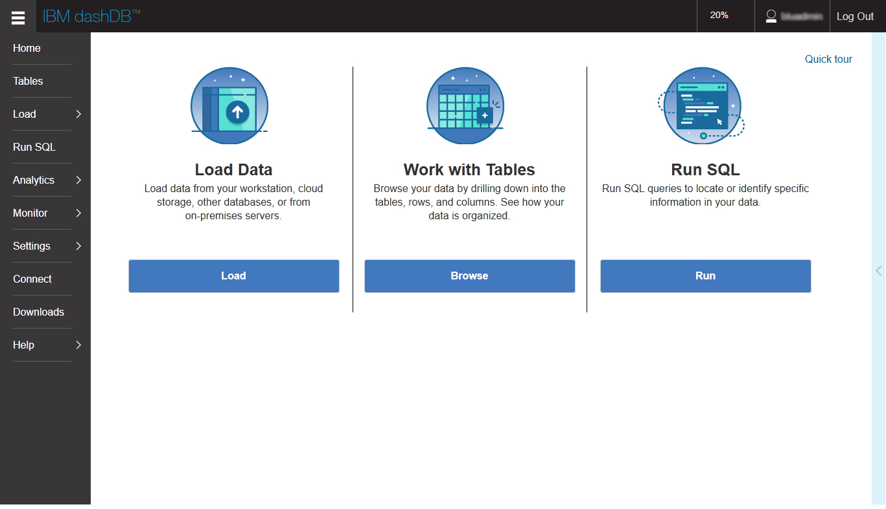

---

copyright:
  years: 2014, 2017
lastupdated: "2017-05-16"

---

<!-- Attribute definitions --> 
{:javascript: #javascript .ph data-hd-programlang='javascript'}
{:java: #java .ph data-hd-programlang='java'}
{:ruby: #ruby .ph data-hd-programlang='ruby'}
{:php: #php .ph data-hd-programlang='php'}
{:python: #python .ph data-hd-programlang='python'}
{:new_window: target="_blank"}
{:shortdesc: .shortdesc}
{:codeblock: .codeblock}
{:screen: .screen}
{:tip: .tip}
{:pre: .pre}

#dashDB 概説
{: #dashDB}

{{site.data.keyword.IBM}} {{site.data.keyword.dashdbshort}} マネージド・サービスは、クラウド内でプロビジョンされた SQL データベースです。任意のデータベース・ソフトウェアを使用するのと同じように {{site.data.keyword.dashdbshort_notm}} を使用できますが、ハードウェアのセットアップやソフトウェアのインストールおよび保守のためのオーバーヘッドもコストもかかりません。
{: shortdesc}

##インターフェース
{: #interfaces}

以下の 4 つの方法で、{{site.data.keyword.dashdbshort_notm}} データベースを使用した作業を行うことができます。
{: shortdesc}

   * {{site.data.keyword.dashdbshort_notm}} Web コンソール
   * REST API
   * ローカル・コンピューターからアプリケーションまたは任意のツールを接続する
   * Bluemix アプリまたはサービス用のデータ・ソースとして {{site.data.keyword.dashdbshort_notm}} を使用する

###dashDB Web コンソール
{: #web_console}

Web コンソールは、ロード機能、SQL エディター、ドライバー・ダウンロードなど、データベースを使用するために必要なすべての操作を実行できるグラフィカル・インターフェースです。
{: shortdesc}


<!--  -->

{{site.data.keyword.dashdbshort_notm}} Web コンソールの概要を見るには、[クイック・ツアー ](http://ibm.biz/dashdb-general-quick-tour){:new_window} をクリックしてください。

{{site.data.keyword.dashdbshort_notm}} Web コンソールには、次の 2 つの方法でアクセスできます。
   * {{site.data.keyword.Bluemix_notm}} ダッシュボードから - {{site.data.keyword.dashdbshort_notm}} サービスの「サービス詳細」ページから Web コンソールを開くことができます。
   * ダイレクト URL - {{site.data.keyword.dashdbshort_notm}} サービスの Web コンソールの URL をブックマークできます。

###REST API
{: #apis}

{{site.data.keyword.dashdbshort_notm}} for Analytics プランでは、ファイル管理、データのロード、および R スクリプトの実行に関連するタスクを、[{{site.data.keyword.dashdbshort_notm}} REST API ](http://ibm.biz/dashdb-api){:new_window} を使用して実行できます。
{: shortdesc}

###ローカル・コンピューターからアプリケーションまたは任意のツールを接続する
{: #connect_apps}

以下の手順を実行して、{{site.data.keyword.dashdbshort_notm}} データベースに接続するようにローカル環境を構成します。
{: shortdesc}

1. {{site.data.keyword.dashdbshort_notm}} Web コンソールの「ダウンロード」ページから [{{site.data.keyword.dashdbshort_notm}} ドライバー・パッケージ ](https://www.ibm.com/support/knowledgecenter/SS6NHC/com.ibm.swg.im.dashdb.doc/connecting/connect_driver_package.html){:new_window} をダウンロードします。
2. アプリまたはツールが実行されているコンピューターで [ドライバー・パッケージのインストール](https://www.ibm.com/support/knowledgecenter/SS6NHC/com.ibm.swg.im.dashdb.doc/connecting/connect_driver_package_install.html){:new_window} を行います。
3. {{site.data.keyword.dashdbshort_notm}} データベース用に[ドライバー・ファイルの構成 ](https://www.ibm.com/support/knowledgecenter/en/SS6NHC/com.ibm.swg.im.dashdb.doc/connecting/connect_driver_package_config.html){:new_window} を行います。

###Bluemix アプリまたはサービス用のデータ・ソースとして dashDB を使用する
{: #data_src}

{{site.data.keyword.Bluemix_notm}} でホストされているアプリは、ローカル・アプリケーションが {{site.data.keyword.dashdbshort_notm}} データベースに接続するのとまったく同じ方法で、{{site.data.keyword.dashdbshort_notm}} データベースに接続できます。
{: shortdesc}

アプリが {{site.data.keyword.Bluemix_notm}} プラットフォームを使用している場合、`VCAP _SERVICES` 環境変数を利用して、データベースの詳細および資格情報を指定する作業を単純化できます。
1. {{site.data.keyword.Bluemix_notm}} ダッシュボードで、{{site.data.keyword.dashdbshort_notm}} サービスの「サービス詳細」ページの**「接続」**タブで、**「接続の作成」**ボタンをクリックします。
2. {{site.data.keyword.dashdbshort_notm}} データベースをデータ・ソースとして使用する {{site.data.keyword.Bluemix_notm}} アプリを選択し、**「接続」**ボタンをクリックします。
3. データベースの詳細および資格情報を `VCAP_SERVICES` 環境変数から取り出すようにアプリケーション・コードを更新します。

    **VCAP_SERVICES を使用しない例**

    ```php
    <?php
    $driver      = "DRIVER={IBM DB2 ODBC DRIVER};";

    $database    = "BLUDB";         # Get these database details from
    $hostname    = "<Host-name>";   # the Connect page of the dashDB
    $port        = 50000;           # web console.
    $user        = "<User-ID >";    #
    $password    = "<Password>";    #
    $dsn         = "DATABASE=$database;" .
                   "HOSTNAME=$hostname;" .
                   "PORT=$port;" .
                   "PROTOCOL=TCPIP;" .
                   "UID=$user;" .
                   "PWD=$password;";

    $conn_string = $driver . $dsn;

    $conn        = db2_connect( $conn_string, "", "" );
    ?>
    ```

    **VCAP_SERVICES を使用する例**

    ```php
    <?php
    $driver      = "DRIVER={IBM DB2 ODBC DRIVER};";

    $vcap        = json_decode( getenv( "VCAP_SERVICES" ), true );
    $dsn         = $vcap[ "dashDB" ][0][ "credentials" ][ "dsn" ];

    $conn_string = $driver . $dsn;
                                   
    $conn        = db2_connect( $conn_string, "", "" );
    ?>
    ```

##例
{: #samples}

各種の言語で作成されたアプリケーションから {{site.data.keyword.dashdbshort_notm}} データベースに接続する方法を示すサンプルへのリンクは次のとおりです。
{: shortdesc}

   * [.NET ](https://www.ibm.com/support/knowledgecenter/SS6NHC/com.ibm.swg.im.dashdb.doc/connecting/connect_connecting__net_applications.html){:new_window}
<!-- * [JAVA ](https://www.ibm.com/support/knowledgecenter/SS6NHC/com.ibm.swg.im.dashdb.doc/connecting/connect_connecting_java.html){:new_window} -->
   * [JDBC ](https://www.ibm.com/support/knowledgecenter/SS6NHC/com.ibm.swg.im.dashdb.doc/connecting/connect_connecting_jdbc_applications.html){:new_window}
<!-- * [Node.js ](https://www.ibm.com/support/knowledgecenter/SS6NHC/com.ibm.swg.im.dashdb.doc/connecting/connect_connecting_nodejs.html){:new_window} -->
   * [PHP ](https://www.ibm.com/support/knowledgecenter/SS6NHC/com.ibm.swg.im.dashdb.doc/connecting/connect_connecting_php.html){:new_window}
<!-- * [Python ](https://www.ibm.com/support/knowledgecenter/SS6NHC/com.ibm.swg.im.dashdb.doc/connecting/connect_connecting_python.html){:new_window} -->
   * [Github にある dashDB サンプル ](https://github.com/IBM-Bluemix/dashdb-nodejs-helloworld){:new_window}


